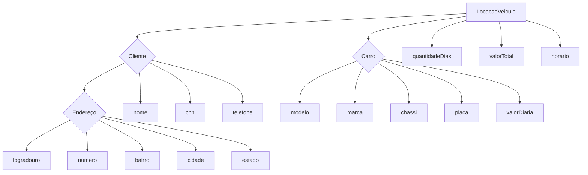

# Desafio Locadora Veiculo API
Este é um desafio para o Bootcamp Santander Backend Java 2023.
## Diagrama

```mermaid
graph TD
    locacao[LocacaoVeiculo]
    cliente{Cliente}
    carro{Carro}
    endereco{Endereço}
    
    locacao --> cliente
    locacao --> carro
    locacao --> quantidadeDias
    locacao --> valorTotal
    locacao --> horario

    cliente --> endereco    
    cliente --> nome
    cliente --> cnh
    cliente --> telefone

    endereco --> logradouro
    endereco --> numero
    endereco --> bairro
    endereco --> cidade
    endereco --> estado
    
    carro --> modelo
    carro --> marca
    carro --> chassi
    carro --> placa
    carro --> valorDiaria
    
    
```
